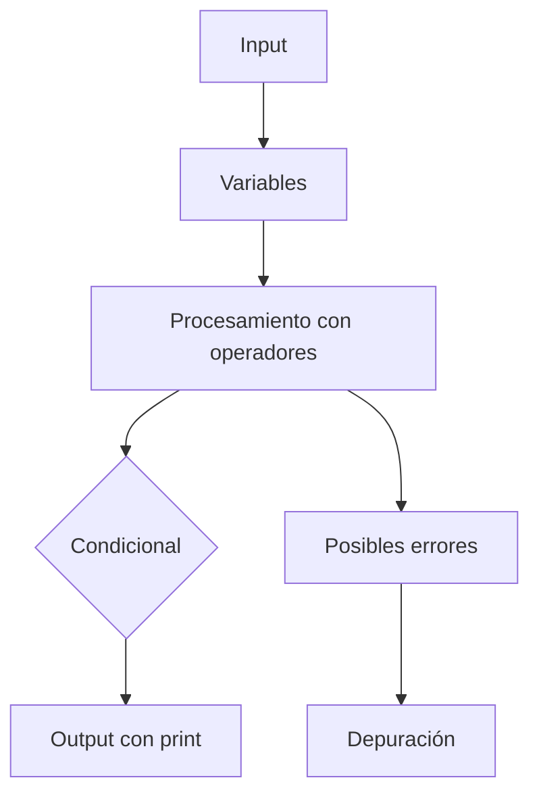

# 📚 Clase 01 · Glosario Fundamental de Python

[⬅️ Volver a la clase](Clase_01_Fundamentos_Python.md) | [📦 Módulo](README.md) |
[🗺️ Mapa modular](../MAPA_MODULAR_COMPLETO.md) | [🏠 Índice general](../README.md)

## 🧠 Definiciones clave (claras y prácticas)

### 1) ¿Qué es programar?

Programar es escribir instrucciones paso a paso para que una computadora resuelva una tarea.

### 2) ¿Qué es Python?

Python es un lenguaje de programación de alto nivel, legible y multipropósito. Se usa en automatización, web, datos, IA
y más.

### 3) ¿Qué es una variable?

Una variable es un nombre que guarda un valor en memoria para usarlo después.

```python
nombre = "Luis"
edad = 25
```

- `nombre` y `edad` son variables.
- `"Luis"` y `25` son valores.

### 4) Tipos de datos básicos

- `int`: enteros (`10`, `-4`)
- `float`: decimales (`3.14`, `0.5`)
- `str`: texto (`"hola"`)
- `bool`: verdadero/falso (`True`, `False`)

```python
cantidad = 3          # int
precio = 19.99        # float
producto = "teclado" # str
disponible = True     # bool
```

### 5) ¿Qué es output (`print`)?

Output es la salida de información. `print()` muestra datos en consola.

```python
print("Hola mundo")
print("Total:", 250)
```

### 6) ¿Qué es input (`input`)?

Input es la entrada de datos del usuario. `input()` siempre devuelve texto (`str`).

```python
nombre = input("Ingresa tu nombre: ")
print("Hola", nombre)
```

> ⚠️ Si necesitas número, convierte el dato:

```python
edad = int(input("Ingresa tu edad: "))
```

### 7) ¿Qué es un operador?

Un operador permite realizar operaciones.

- Aritméticos: `+`, `-`, `*`, `/`, `%`
- Comparación: `==`, `!=`, `>`, `<`, `>=`, `<=`
- Lógicos: `and`, `or`, `not`

```python
print(10 + 5)      # 15
print(10 > 3)      # True
print(True and False)  # False
```

### 8) ¿Qué es un condicional?

Un condicional permite tomar decisiones según una condición.

```python
edad = 17
if edad >= 18:
    print("Mayor de edad")
else:
    print("Menor de edad")
```

### 9) ¿Qué es un bloque de código?

Es un conjunto de instrucciones que pertenecen a una estructura (`if`, `for`, función) y en Python se define por
indentación.

```python
if True:
    print("Dentro del bloque")
print("Fuera del bloque")
```

### 10) ¿Qué es un error?

Un error es un problema que impide que el programa funcione como esperas.

#### Errores comunes en Clase 1

- **SyntaxError**: error de sintaxis (código mal escrito)
- **NameError**: variable no definida
- **TypeError**: operación entre tipos incompatibles
- **ValueError**: conversión inválida (ej. `int("hola")`)
- **IndentationError**: mala indentación

```python
# ValueError
numero = int("hola")
```

### 11) ¿Qué es depurar (debug)?

Depurar es revisar y corregir errores para que el programa funcione.

Pasos recomendados:

1. Leer el mensaje de error.
2. Ubicar línea exacta.
3. Verificar tipo de dato esperado.
4. Probar de nuevo.

### 12) Buenas prácticas iniciales

- Usar nombres descriptivos: `edad_usuario` en lugar de `x`.
- Mostrar mensajes claros al usuario.
- Validar datos de entrada.
- Escribir y probar por partes.

## 🧭 Mini mapa conceptual


