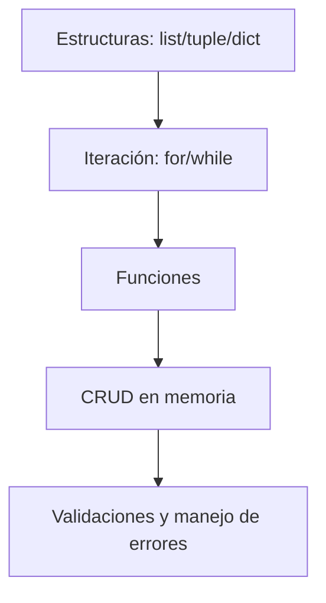

# 📚 Clase 02 · Glosario: Estructuras y Funciones

[⬅️ Volver a la clase](Clase_02_Estructuras_y_Funciones.md) | [📦 Módulo](README.md) |
[🗺️ Mapa modular](../MAPA_MODULAR_COMPLETO.md) | [🏠 Índice general](../README.md)

## 1) ¿Qué es una estructura de datos?

Es una forma de organizar información para poder guardarla, recorrerla y modificarla de manera eficiente.

## 2) Lista (`list`)

Colección **ordenada** y **mutable**.

```python
frutas = ["manzana", "pera", "uva"]
frutas.append("mango")
```

- Tiene índices (`frutas[0]`).
- Permite agregar, eliminar y editar elementos.

## 3) Tupla (`tuple`)

Colección **ordenada** e **inmutable**.

```python
coordenada = (10, 20)
```

- No se puede modificar después de creada.
- Útil para datos que no deben cambiar.

## 4) Diccionario (`dict`)

Colección de pares **clave: valor**.

```python
usuario = {"nombre": "Ana", "edad": 23}
print(usuario["nombre"])
```

- Muy útil para representar entidades (usuario, producto, pedido).

## 5) ¿Qué es iterar?

Iterar es recorrer una colección elemento por elemento.

```python
for fruta in frutas:
    print(fruta)
```

## 6) Bucle `for`

Se usa cuando sabes qué colección vas a recorrer.

```python
for i in range(5):
    print(i)
```

## 7) Bucle `while`

Se usa mientras una condición sea verdadera.

```python
contador = 0
while contador < 3:
    print(contador)
    contador += 1
```

## 8) ¿Qué es una función?

Bloque de código reutilizable que realiza una tarea específica.

```python
def saludar(nombre):
    return f"Hola, {nombre}"
```

## 9) Parámetro vs argumento

- **Parámetro:** variable declarada en la función.
- **Argumento:** valor real enviado al llamar la función.

```python
def cuadrado(numero):   # parametro
    return numero * numero

print(cuadrado(4))      # argumento
```

## 10) `return`

Permite devolver un valor desde una función.

```python
def sumar(a, b):
    return a + b
```

Si no usas `return`, la función devuelve `None`.

## 11) Alcance de variables (scope)

- **Local:** existe dentro de una función.
- **Global:** existe fuera y puede leerse desde funciones.

```python
x = 10  # global

def demo():
    y = 5  # local
    return x + y
```

## 12) CRUD en memoria

CRUD = Create, Read, Update, Delete aplicado a datos en listas/diccionarios.

- Crear: agregar registro.
- Leer: listar registros.
- Actualizar: modificar registro.
- Eliminar: quitar registro.

## 13) Errores frecuentes de esta clase

- `IndexError`: índice fuera de rango.
- `KeyError`: clave inexistente en diccionario.
- `TypeError`: tipo incorrecto en operación.
- `ValueError`: conversión inválida.

## 14) Buenas prácticas clave

- Dividir el programa en funciones pequeñas.
- Nombrar funciones con verbos (`crear_usuario`, `listar_productos`).
- Validar entradas antes de procesar.
- Reutilizar funciones en lugar de duplicar código.

## 🗺️ Mapa de aprendizaje


