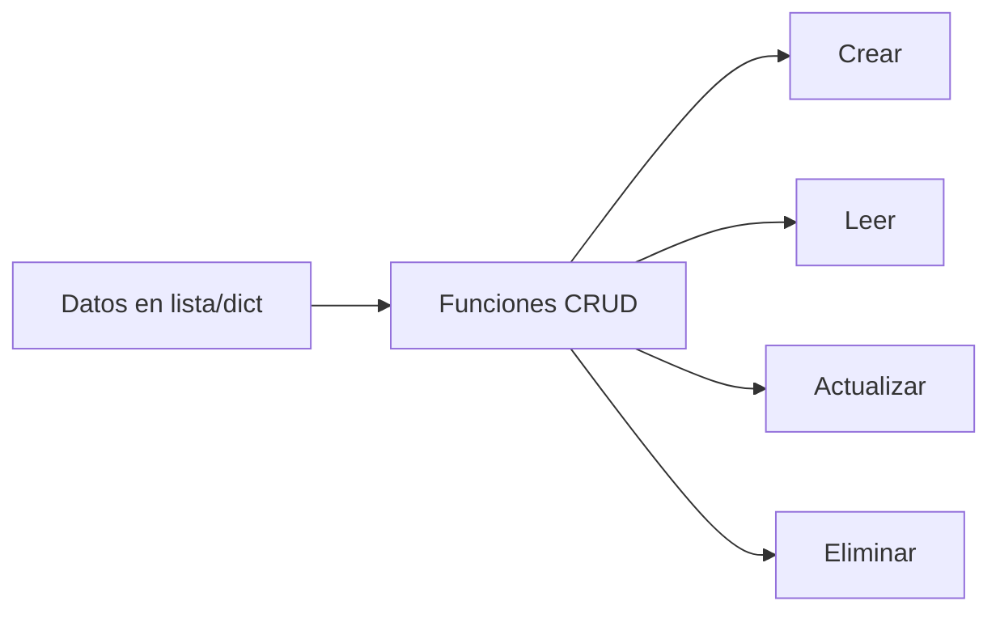

# 🧩 Clase 02: Estructuras y Funciones

[🏠 Volver al índice](../README.md) [⬅️ Clase anterior](../Clase_01_Fundamentos_Python/Clase_01_Fundamentos_Python.md) |
[➡️ Siguiente clase](../Clase_03_POO_en_Python/Clase_03_POO_en_Python.md)

## 🎯 Tema

Estructuras de datos y reutilización de código con funciones.

## 🧭 Objetivo general

Dominar el uso de estructuras de datos básicas y organizar programas en funciones reutilizables para construir
soluciones más limpias y escalables.

## 🎯 Objetivos específicos

Al finalizar la clase, el estudiante podrá:

1. Explicar diferencias entre lista, tupla y diccionario.
2. Recorrer estructuras con `for` y `while`.
3. Crear funciones con parámetros y `return`.
4. Construir un CRUD en memoria con validaciones.

## 🧠 Explicación

Las estructuras te ayudan a organizar información (listas, tuplas, diccionarios) y las funciones te permiten reutilizar
lógica para evitar repetir código.

Esta clase marca el paso de "programas sueltos" a "programas organizados".

## 🧱 Estructura de la clase

- **Objetivo:** manipular colecciones de datos y crear funciones reutilizables.
- **Conceptos clave:** listas, tuplas, diccionarios, bucles `for/while`, funciones, `return`.
- **Práctica guiada:** CRUD de usuarios en memoria.
- **Reto:** sistema de gestión en consola por funciones.

## 🗂️ Contenido enriquecido de la Clase 2

- [📚 Glosario de estructuras y funciones](01_Glosario_Estructuras_y_Funciones.md)
- [🧪 Ejemplos paso a paso](02_Ejemplos_Paso_a_Paso.md)
- [🧩 Banco amplio de ejercicios](03_Ejercicios_Clase_02.md)
- [✅ Ejercicios resueltos (selección)](04_Ejercicios_Resueltos_Clase_02.md)
- [🧠 Reto guiado de clase](05_Reto_Guiado_Clase_02.md)

## 📊 Gráfico conceptual



## 💻 Código de ejemplo

```python
usuarios = []

def crear_usuario(nombre, correo):
    usuarios.append({"nombre": nombre, "correo": correo})
    return "Usuario creado ✅"

def listar_usuarios():
    for i, user in enumerate(usuarios, start=1):
        print(i, user["nombre"], user["correo"])

print(crear_usuario("Ana", "ana@mail.com"))
listar_usuarios()
```

## 🧩 Definiciones rápidas (resumen)

- **Lista:** colección ordenada y mutable.
- **Tupla:** colección ordenada e inmutable.
- **Diccionario:** estructura de clave-valor.
- **Función:** bloque reutilizable que encapsula una tarea.
- **`return`:** valor que la función devuelve al finalizar.

> Para definiciones completas y casos de uso, revisa el [glosario](01_Glosario_Estructuras_y_Funciones.md).

## 🛠️ Práctica sugerida

1. Agregar función para editar usuario por índice.
2. Agregar función para eliminar usuario por índice.
3. Mostrar mensajes de error si el índice no existe.

## 🏋️ Práctica ampliada recomendada

- Resolver ejercicios **1 al 15** del [banco de ejercicios](03_Ejercicios_Clase_02.md).
- Resolver **8 ejercicios** del nivel intermedio.
- Resolver **4 ejercicios** del nivel desafío.
- Implementar el [reto guiado](05_Reto_Guiado_Clase_02.md).

## ⏱️ Sugerencia de ritmo para 2 horas

- 20 min: teoría de estructuras.
- 25 min: funciones y `return`.
- 45 min: CRUD guiado en vivo.
- 30 min: ejercicios por niveles + feedback.

## 🧪 Criterios de evaluación rápida

- **Comprensión de estructuras (30%)**
- **Modularización en funciones (30%)**
- **Lógica CRUD y validaciones (30%)**
- **Claridad del código (10%)**

## ✅ Checklist

- [ ] Uso listas y diccionarios correctamente.
- [ ] Creo funciones con parámetros.
- [ ] Devuelvo valores con `return`.
- [ ] Mi CRUD básico funciona.
- [ ] Apliqué validaciones para evitar errores comunes.
- [ ] Resolví ejercicios de al menos 2 niveles.

---

## 🚀 Entregable de la Clase 2

Subir un archivo `clase2_crud_modular.py` con:

1. Menú en `while`.
2. Funciones separadas para crear/listar/editar/eliminar.
3. Manejo de índices inválidos.
4. Mensajes de estado claros.
5. Código ordenado y legible.
