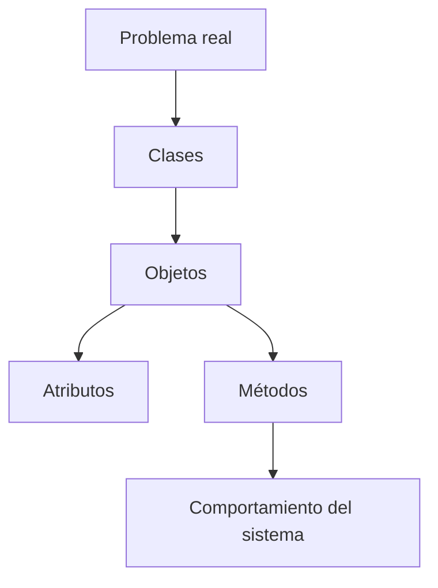

# 📚 Clase 03 · Glosario de Programación Orientada a Objetos (POO)

[⬅️ Volver a la clase](Clase_03_POO_en_Python.md) | [📦 Módulo](README.md) |
[🗺️ Mapa modular](../MAPA_MODULAR_COMPLETO.md) | [🏠 Índice general](../README.md)

## 1) ¿Qué es POO?

La Programación Orientada a Objetos es un paradigma para modelar problemas del mundo real mediante objetos que tienen
datos (atributos) y comportamientos (métodos).

## 2) Clase

Plantilla o molde que define cómo serán los objetos.

```python
class Producto:
    pass
```

## 3) Objeto (instancia)

Elemento concreto creado a partir de una clase.

```python
p1 = Producto()
```

## 4) Atributo

Dato asociado a un objeto.

```python
class Producto:
    def __init__(self, nombre):
        self.nombre = nombre
```

## 5) Método

Función definida dentro de una clase que describe comportamiento.

```python
class Producto:
    def mostrar(self):
        return "Mostrando producto"
```

## 6) Constructor `__init__`

Método especial que se ejecuta al crear un objeto. Sirve para inicializar atributos.

```python
class Usuario:
    def __init__(self, nombre, email):
        self.nombre = nombre
        self.email = email
```

## 7) `self`

Referencia al objeto actual. Permite acceder a sus atributos y métodos.

## 8) Encapsulamiento (básico)

Práctica para proteger datos y controlar cómo se accede a ellos.

```python
class Cuenta:
    def __init__(self, saldo):
        self._saldo = saldo  # convención de protegido
```

## 9) Abstracción

Consiste en mostrar solo lo necesario y ocultar complejidad interna.

## 10) Herencia

Permite que una clase hija reutilice atributos/métodos de una clase padre.

```python
class Persona:
    def saludar(self):
        return "Hola"

class Estudiante(Persona):
    pass
```

## 11) Polimorfismo

Diferentes clases pueden responder al mismo método con comportamientos distintos.

```python
class Gato:
    def sonido(self):
        return "Miau"

class Perro:
    def sonido(self):
        return "Guau"
```

## 12) Relaciones entre clases

- Asociación: una clase usa otra.
- Agregación: una clase contiene otras pero pueden existir solas.
- Composición: una clase contiene otras y dependen de ella.

## 13) Errores frecuentes en POO inicial

- Olvidar `self` en métodos.
- Crear atributo fuera de `__init__` sin inicializar correctamente.
- Confundir clase con objeto.
- Llamar métodos sin crear instancia.

## 14) Buenas prácticas en esta etapa

- Modelar entidades claras (Usuario, Producto, Pedido).
- Usar nombres de clase en singular y PascalCase.
- Mantener métodos pequeños y con una sola responsabilidad.
- Inicializar atributos esenciales en `__init__`.

## 🗺️ Mapa conceptual


