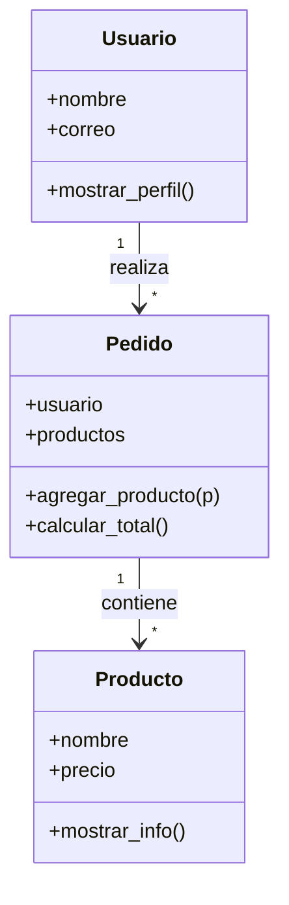
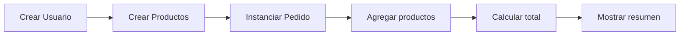

# 🗺️ Clase 03 · Diagramas de apoyo (POO)

[⬅️ Volver a la clase](Clase_03_POO_en_Python.md) | [📦 Módulo](README.md) |
[🗺️ Mapa modular](../MAPA_MODULAR_COMPLETO.md) | [🏠 Índice general](../README.md)

## Diagrama UML básico

## Flujo de creación de pedido

