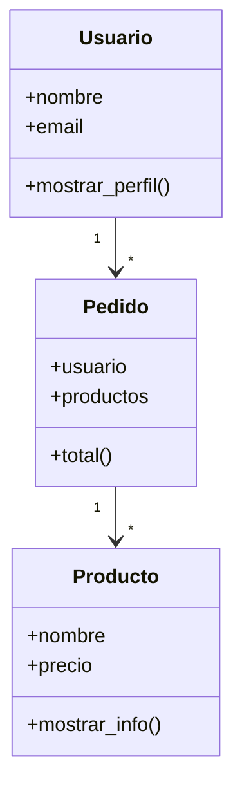

# 🏗️ Clase 03: Programación Orientada a Objetos (POO)

[🏠 Volver al índice](../README.md)
[⬅️ Clase anterior](../Clase_02_Estructuras_y_Funciones/Clase_02_Estructuras_y_Funciones.md) |
[➡️ Siguiente clase](../Clase_04_Introduccion_Django/Clase_04_Introduccion_Django.md)

## 🎯 Tema

Modelado de entidades reales con clases y objetos.

## 🧭 Objetivo general

Comprender cómo convertir un problema real en clases y objetos para crear código más organizado, reutilizable y
mantenible.

## 🎯 Objetivos específicos

Al finalizar la clase, el estudiante podrá:

1. Diferenciar clase, objeto, atributo y método.
2. Implementar `__init__` y usar `self` correctamente.
3. Modelar relaciones básicas entre clases (`Usuario`, `Producto`, `Pedido`).
4. Construir un mini sistema orientado a objetos funcional.

## 🧠 Explicación

La POO permite organizar el código como objetos con datos (atributos) y comportamientos (métodos), haciendo el proyecto
más escalable y mantenible.

La idea central de la clase es pasar de "funciones sueltas" a "modelos del dominio".

## 🧱 Estructura de la clase

- **Objetivo:** crear clases útiles para representar un dominio real.
- **Conceptos clave:** clase, objeto, `__init__`, métodos, atributos, `self`.
- **Práctica guiada:** `Usuario`, `Producto`, `Pedido`.
- **Reto:** mini sistema de pedidos orientado a objetos.

## 🗂️ Contenido enriquecido de la Clase 3

- [📚 Glosario de POO](01_Glosario_POO.md)
- [🧪 Ejemplos POO paso a paso](02_Ejemplos_POO_Paso_a_Paso.md)
- [🧩 Banco amplio de ejercicios](03_Ejercicios_Clase_03_POO.md)
- [✅ Ejercicios resueltos (selección)](04_Ejercicios_Resueltos_Clase_03.md)
- [🧠 Reto guiado](05_Reto_Guiado_Clase_03.md)
- [🗺️ Diagramas de apoyo](06_Diagrama_POO_Clase_03.md)
- [❓ Quiz de repaso](07_Quiz_Clase_03.md)

## 📊 Gráfico conceptual



## 💻 Código de ejemplo

```python
class Producto:
    def __init__(self, nombre, precio):
        self.nombre = nombre
        self.precio = precio

    def mostrar_info(self):
        return f"{self.nombre} - ${self.precio}"

p1 = Producto("Teclado", 120000)
print(p1.mostrar_info())
```

## 🧩 Definiciones rápidas (resumen)

- **Clase:** molde que define estructura y comportamiento.
- **Objeto:** instancia concreta de una clase.
- **Atributo:** dato del objeto.
- **Método:** acción/comportamiento del objeto.
- **`self`:** referencia al objeto actual.

> Para una explicación detallada de encapsulamiento, herencia y polimorfismo revisa el [glosario](01_Glosario_POO.md).

## 🛠️ Práctica sugerida

1. Crear clase `Usuario` con método `saludar()`.
2. Crear clase `Pedido` que reciba lista de productos.
3. Calcular total del pedido.

## 🏋️ Práctica ampliada recomendada

- Resolver ejercicios **1 al 15** del [banco de ejercicios](03_Ejercicios_Clase_03_POO.md).
- Resolver **8 ejercicios** del nivel intermedio.
- Resolver **4 ejercicios** del nivel desafío.
- Completar el [reto guiado](05_Reto_Guiado_Clase_03.md).
- Cerrar con el [quiz](07_Quiz_Clase_03.md).

## ⏱️ Sugerencia de ritmo para 2 horas

- 20 min: fundamentos conceptuales de POO.
- 30 min: modelado en vivo de clases.
- 45 min: práctica guiada del sistema de pedidos.
- 25 min: ejercicios + retroalimentación.

## 🧪 Criterios de evaluación rápida

- **Modelado correcto de clases (30%)**
- **Uso de `__init__` y `self` (25%)**
- **Relaciones entre objetos (25%)**
- **Claridad y orden del código (20%)**

## ✅ Checklist

- [ ] Entiendo la diferencia entre clase y objeto.
- [ ] Uso `__init__` correctamente.
- [ ] Creo métodos propios.
- [ ] Modelo un problema real con POO.
- [ ] Apliqué al menos una relación entre clases.
- [ ] Resolví ejercicios de dos niveles o más.

---

## 🚀 Entregable de la Clase 3

Subir archivo `clase3_poo_pedidos.py` con:

1. Clase `Usuario`.
2. Clase `Producto`.
3. Clase `Pedido` con lista de productos.
4. Método para calcular total.
5. Salida final con resumen legible del pedido.
