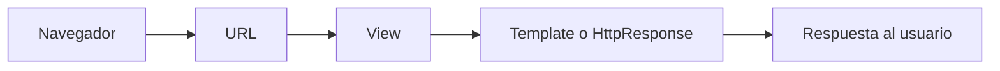

# 📚 Clase 04 · Glosario Django Inicial

[⬅️ Volver a la clase](Clase_04_Introduccion_Django.md) | [📦 Módulo](README.md) |
[🗺️ Mapa modular](../MAPA_MODULAR_COMPLETO.md) | [🏠 Índice general](../README.md)

## 1) ¿Qué es Django?

Django es un framework web de Python que ayuda a construir aplicaciones rápidas, seguras y escalables.

## 2) Framework web

Conjunto de herramientas y convenciones para crear aplicaciones web sin empezar desde cero.

## 3) MVT (Model-View-Template)

Patrón de Django para separar responsabilidades:

- **Model:** datos y reglas de negocio.
- **View:** lógica de petición/respuesta.
- **Template:** presentación HTML.

## 4) Proyecto vs App

- **Proyecto:** configuración global del sitio.
- **App:** módulo funcional del sistema (usuarios, productos, etc.).

## 5) `manage.py`

Script principal para ejecutar comandos de Django.

```bash
python manage.py runserver
```

## 6) `startproject`

Comando para crear la estructura base del proyecto.

```bash
django-admin startproject mi_proyecto .
```

## 7) `startapp`

Comando para crear una aplicación dentro del proyecto.

```bash
python manage.py startapp core
```

## 8) `runserver`

Levanta el servidor local para desarrollo.

## 9) `settings.py`

Archivo central de configuración del proyecto.

- Apps instaladas
- Base de datos
- Idioma/zona horaria
- Archivos estáticos

## 10) `urls.py`

Mapa de rutas URL del proyecto y apps.

## 11) `views.py`

Define funciones o clases que responden peticiones HTTP.

## 12) `HttpResponse`

Respuesta simple de texto desde una vista.

## 13) `render()`

Función para devolver una plantilla HTML con contexto.

## 14) Template

Archivo HTML dinámico con etiquetas de plantilla de Django.

## 15) Errores frecuentes de esta clase

- App no registrada en `INSTALLED_APPS`.
- URL no incluida en el `urls.py` principal.
- Plantilla en ruta equivocada.
- No ejecutar `runserver` en carpeta correcta.

## 🗺️ Mapa conceptual


