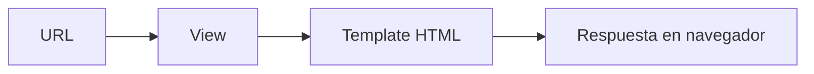

# 🌐 Clase 04: Introducción a Django

[🏠 Volver al índice](../README.md) [⬅️ Clase anterior](../Clase_03_POO_en_Python/Clase_03_POO_en_Python.md) |
[➡️ Siguiente clase](../Clase_05_Modelos_y_Base_de_Datos/Clase_05_Modelos_y_Base_de_Datos.md)

## 🎯 Tema

Primer proyecto web con Django y estructura MVT.

## 🧭 Objetivo general

Iniciar el desarrollo web con Django creando un proyecto funcional con rutas, vistas y templates organizados.

## 🎯 Objetivos específicos

Al finalizar la clase, el estudiante podrá:

1. Explicar la arquitectura MVT de Django.
2. Crear un proyecto y una app correctamente.
3. Configurar URLs del proyecto y de la app.
4. Construir vistas con `HttpResponse` y `render`.
5. Crear páginas base con templates reutilizables.

## 🧠 Explicación

Django es un framework que acelera el desarrollo web. Permite organizar el proyecto con modelos, vistas y templates para
separar responsabilidades.

En esta clase se construye la base del proyecto sobre la que crecerán las siguientes clases (modelos, CRUD,
autenticación y deploy).

## 🧱 Estructura de la clase

- **Objetivo:** crear proyecto, app y rutas iniciales.
- **Conceptos clave:** `startproject`, `startapp`, `views.py`, `urls.py`, `runserver`.
- **Práctica guiada:** páginas Inicio, Acerca de y Contacto.
- **Reto:** agregar una vista personalizada.

## 🗂️ Contenido enriquecido de la Clase 4

- [📚 Glosario Django inicial](01_Glosario_Django_Inicial.md)
- [🧰 Comandos base de Django](02_Comandos_Base_Django.md)
- [🧪 Ejemplos paso a paso](03_Ejemplos_Paso_a_Paso_Clase_04.md)
- [🧩 Banco amplio de ejercicios](04_Ejercicios_Clase_04.md)
- [✅ Ejercicios resueltos (selección)](05_Ejercicios_Resueltos_Clase_04.md)
- [🧠 Reto guiado de clase](06_Reto_Guiado_Clase_04.md)
- [✅ Checklist técnico](07_Checklist_Tecnico_Clase_04.md)

## 📊 Gráfico conceptual



## 💻 Código de ejemplo

```python
# views.py
from django.http import HttpResponse

def inicio(request):
    return HttpResponse("Bienvenido al curso Django 🚀")
```

```python
# urls.py
from django.urls import path
from . import views

urlpatterns = [
    path('', views.inicio, name='inicio'),
]
```

## 🧩 Definiciones rápidas (resumen)

- **Proyecto Django:** contenedor principal de configuración.
- **App Django:** módulo funcional con responsabilidad específica.
- **View:** lógica que responde a la URL.
- **URL:** ruta que conecta petición con una vista.
- **Template:** archivo HTML que muestra la interfaz.

> Puedes ampliar cada concepto en el [glosario](01_Glosario_Django_Inicial.md).

## 🛠️ Práctica sugerida

1. Crear 3 vistas con texto diferente.
2. Conectar rutas en `urls.py`.
3. Verificar todo en navegador.

## 🏋️ Práctica ampliada recomendada

- Resolver ejercicios **1 al 15** del [banco de ejercicios](04_Ejercicios_Clase_04.md).
- Resolver **8 ejercicios** del bloque intermedio.
- Resolver **4 ejercicios** del bloque desafío.
- Completar el [reto guiado](06_Reto_Guiado_Clase_04.md).
- Validar todo con el [checklist técnico](07_Checklist_Tecnico_Clase_04.md).

## ⏱️ Sugerencia de ritmo para 2 horas

- 25 min: conceptos y arquitectura MVT.
- 25 min: setup de proyecto y app.
- 40 min: rutas y vistas en vivo.
- 30 min: templates + ejercicios + revisión.

## 🧪 Criterios de evaluación rápida

- **Configuración inicial correcta (25%)**
- **Rutas y vistas funcionales (35%)**
- **Uso de templates (25%)**
- **Orden del proyecto (15%)**

## ✅ Checklist

- [ ] Proyecto Django creado correctamente.
- [ ] App registrada en settings.
- [ ] Rutas funcionando.
- [ ] Vistas responden sin error.
- [ ] Template base creado y reutilizado.
- [ ] Entrega validada con checklist técnico.

---

## 🚀 Entregable de la Clase 4

Subir mini proyecto Django con:

1. App `core` configurada.
2. Mínimo 5 páginas navegables.
3. Template base con herencia.
4. Estructura de carpetas ordenada.
5. Instrucciones de ejecución en README.
