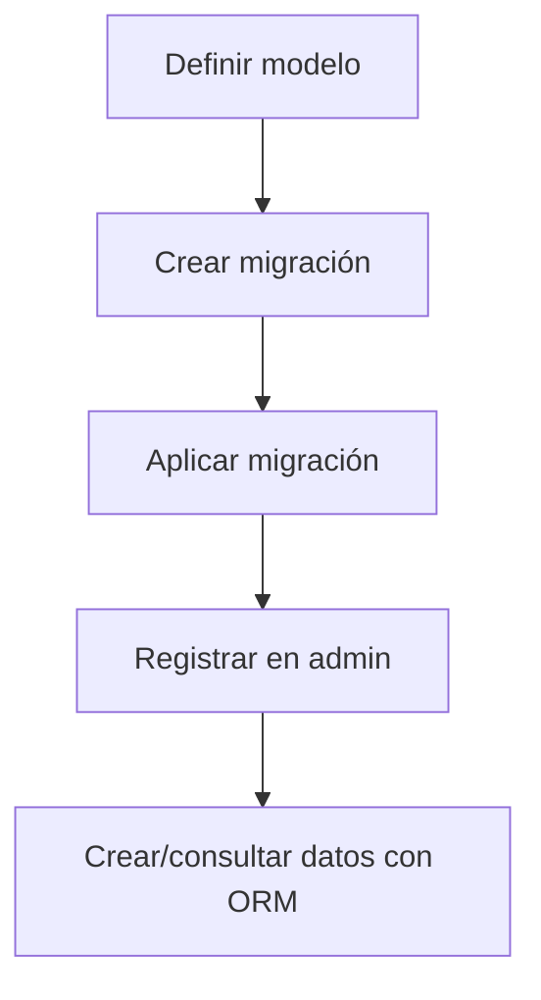

# 📚 Clase 05 · Glosario de Modelos y ORM

[⬅️ Volver a la clase](Clase_05_Modelos_y_Base_de_Datos.md) | [📦 Módulo](README.md) |
[🗺️ Mapa modular](../MAPA_MODULAR_COMPLETO.md) | [🏠 Índice general](../README.md)

## 1) ¿Qué es un modelo en Django?

Un modelo es una clase Python que representa una tabla en la base de datos.

## 2) ¿Qué es el ORM?

ORM (Object Relational Mapping) permite trabajar con datos como objetos de Python en lugar de escribir SQL manual para
operaciones comunes.

## 3) `models.Model`

Clase base que deben heredar los modelos de Django.

## 4) Campo (`Field`)

Define el tipo de dato que tendrá una columna.

Ejemplos comunes:

- `CharField`: texto corto
- `TextField`: texto largo
- `IntegerField`: entero
- `DecimalField`: decimal exacto
- `BooleanField`: verdadero/falso
- `DateTimeField`: fecha y hora

## 5) Clave primaria

Django crea automáticamente el campo `id` como clave primaria (salvo que definas otra).

## 6) `ForeignKey`

Relación muchos-a-uno entre modelos.

```python
categoria = models.ForeignKey(Categoria, on_delete=models.CASCADE)
```

## 7) `on_delete`

Define qué ocurre con registros relacionados cuando se elimina el objeto padre.

- `CASCADE`: elimina hijos relacionados.
- `PROTECT`: bloquea eliminación del padre.
- `SET_NULL`: pone `NULL` (si el campo permite nulo).

## 8) `__str__`

Método para mostrar representación legible del objeto (muy útil en admin).

## 9) Migraciones

Archivos que registran cambios en modelos para aplicarlos a la base de datos.

Comandos clave:

- `makemigrations`: crea migraciones nuevas.
- `migrate`: aplica migraciones.

## 10) Django Admin

Panel de administración listo para gestionar datos del proyecto.

## 11) QuerySet

Conjunto de resultados que devuelve el ORM.

```python
Producto.objects.all()
Producto.objects.filter(precio__gte=100)
```

## 12) Validación básica del modelo

Se puede aplicar con argumentos de campo (`max_length`, `blank`, `null`, etc.).

## 13) Errores frecuentes de esta clase

- No ejecutar migraciones después de cambiar modelos.
- No registrar modelo en admin.
- Mal uso de `ForeignKey`.
- Olvidar importar modelos.

## 14) Buenas prácticas

- Nombres de modelos en singular y PascalCase.
- Agregar `__str__` en todos los modelos.
- Definir relaciones pensando en el dominio real.
- Hacer migraciones pequeñas y frecuentes.

## 🗺️ Mapa conceptual


