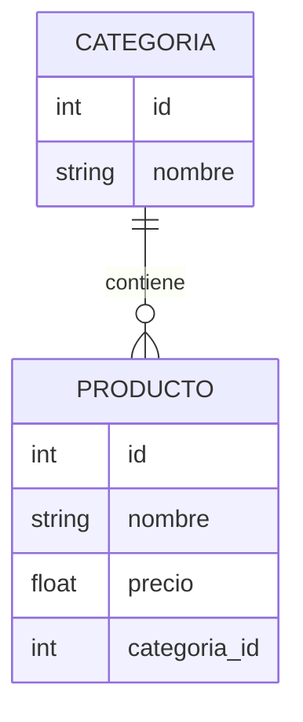

# 🗄️ Clase 05: Modelos y Base de Datos

[🏠 Volver al índice](../README.md) [⬅️ Clase anterior](../Clase_04_Introduccion_Django/Clase_04_Introduccion_Django.md)
| [➡️ Siguiente clase](../Clase_06_CRUD_Completo/Clase_06_CRUD_Completo.md)

## 🎯 Tema

Persistencia de datos con ORM y administración con Django Admin.

## 🧭 Objetivo general

Diseñar la estructura de datos de una aplicación Django mediante modelos relacionados, migraciones correctas y
administración eficiente desde Django Admin.

## 🎯 Objetivos específicos

Al finalizar la clase, el estudiante podrá:

1. Definir modelos y campos adecuados para un dominio real.
2. Implementar relaciones con `ForeignKey` y políticas de borrado.
3. Ejecutar migraciones sin errores.
4. Administrar datos desde Django Admin.
5. Realizar consultas ORM básicas en shell.

## 🧠 Explicación

Los modelos representan tablas de base de datos. Con el ORM de Django trabajas con objetos Python en lugar de escribir
SQL manual en la mayoría de casos.

Esta clase es la base de todo el CRUD: si el modelo está bien diseñado, las siguientes capas (formularios, vistas y
permisos) serán mucho más simples.

## 🧱 Estructura de la clase

- **Objetivo:** diseñar modelos y crear relaciones.
- **Conceptos clave:** `models.Model`, campos, `ForeignKey`, migraciones, admin.
- **Práctica guiada:** `Categoria` y `Producto`.
- **Reto:** agregar modelo relacionado extra.

## 🗂️ Contenido enriquecido de la Clase 5

- [📚 Glosario de modelos y ORM](01_Glosario_Modelos_ORM.md)
- [🧰 Comandos de migraciones y admin](02_Comandos_Migraciones_y_Admin.md)
- [🧪 Ejemplos paso a paso](03_Ejemplos_Paso_a_Paso_Clase_05.md)
- [🧩 Banco amplio de ejercicios](04_Ejercicios_Clase_05.md)
- [✅ Ejercicios resueltos (selección)](05_Ejercicios_Resueltos_Clase_05.md)
- [🧠 Reto guiado de clase](06_Reto_Guiado_Clase_05.md)
- [✅ Checklist técnico](07_Checklist_Tecnico_Clase_05.md)

## 📊 Gráfico conceptual



## 💻 Código de ejemplo

```python
from django.db import models

class Categoria(models.Model):
    nombre = models.CharField(max_length=100)

    def __str__(self):
        return self.nombre

class Producto(models.Model):
    nombre = models.CharField(max_length=120)
    precio = models.DecimalField(max_digits=10, decimal_places=2)
    categoria = models.ForeignKey(Categoria, on_delete=models.CASCADE)

    def __str__(self):
        return self.nombre
```

## 🧩 Definiciones rápidas (resumen)

- **Modelo:** representación de una tabla en Python.
- **ORM:** capa para consultar y manipular datos sin SQL manual en tareas comunes.
- **Migración:** registro versionado de cambios en el esquema.
- **ForeignKey:** relación entre modelo hijo y modelo padre.
- **Admin:** panel de gestión de datos integrado en Django.

> Puedes ampliar cada concepto en el [glosario](01_Glosario_Modelos_ORM.md).

## 🛠️ Práctica sugerida

1. Crear y aplicar migraciones.
2. Registrar modelos en admin.
3. Insertar datos de prueba.

## 🏋️ Práctica ampliada recomendada

- Resolver ejercicios **1 al 15** del [banco de ejercicios](04_Ejercicios_Clase_05.md).
- Resolver **8 ejercicios** del bloque intermedio.
- Resolver **4 ejercicios** del bloque desafío.
- Completar el [reto guiado](06_Reto_Guiado_Clase_05.md).
- Validar entrega con el [checklist técnico](07_Checklist_Tecnico_Clase_05.md).

## ⏱️ Sugerencia de ritmo para 2 horas

- 20 min: teoría de modelos y relaciones.
- 25 min: implementación de `Categoria` y `Producto`.
- 35 min: migraciones + admin.
- 40 min: ejercicios ORM y validación final.

## 🧪 Criterios de evaluación rápida

- **Diseño de modelos (30%)**
- **Relaciones y consistencia (25%)**
- **Migraciones y admin funcional (30%)**
- **Orden y claridad técnica (15%)**

## ✅ Checklist

- [ ] Modelos creados.
- [ ] Migraciones aplicadas.
- [ ] Relación entre tablas funcional.
- [ ] Datos visibles en admin.
- [ ] Consultas ORM básicas verificadas en shell.
- [ ] Entrega validada con checklist técnico.

---

## 🚀 Entregable de la Clase 5

Subir módulo de datos con:

1. Modelos `Categoria` y `Producto` (mínimo).
2. Un modelo relacionado extra (`Marca` o `Proveedor`).
3. Migraciones aplicadas correctamente.
4. Admin configurado y funcional.
5. Evidencia de consultas básicas ORM.
