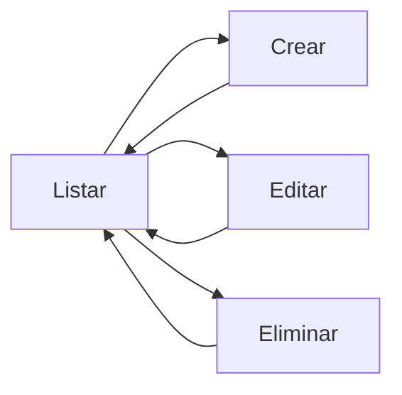

# 📚 Clase 06 · Glosario CRUD en Django

[⬅️ Volver a la clase](Clase_06_CRUD_Completo.md) | [📦 Módulo](README.md) |
[🗺️ Mapa modular](../MAPA_MODULAR_COMPLETO.md) | [🏠 Índice general](../README.md)

## 1) ¿Qué es CRUD?

CRUD significa Create, Read, Update, Delete: crear, leer, actualizar y eliminar datos.

## 2) Create

Operación para crear un nuevo registro en base de datos.

## 3) Read

Operación para listar o consultar datos existentes.

## 4) Update

Operación para modificar datos de un registro existente.

## 5) Delete

Operación para eliminar un registro.

## 6) Vista (View)

Función o clase que procesa la petición y devuelve respuesta.

## 7) Formulario (`forms.py`)

Componente para capturar y validar entrada de usuario.

## 8) `ModelForm`

Formulario vinculado a un modelo que genera campos automáticamente.

## 9) Template

Archivo HTML que presenta la interfaz para listar/crear/editar/eliminar.

## 10) `redirect`

Respuesta que redirige a otra URL tras completar una acción.

## 11) `get_object_or_404`

Obtiene un objeto por ID; si no existe, devuelve 404.

## 12) Mensajes (`django.contrib.messages`)

Permiten mostrar feedback al usuario (éxito/error/aviso).

## 13) URL patterns

Definen las rutas para cada operación CRUD.

## 14) Validación de formulario

Se ejecuta con `form.is_valid()` antes de guardar datos.

## 15) Errores frecuentes

- No incluir rutas CRUD en `urls.py`.
- No renderizar errores del formulario en template.
- Falta de `csrf_token` en formularios POST.
- No manejar objeto inexistente en update/delete.

## 🗺️ Flujo básico CRUD

