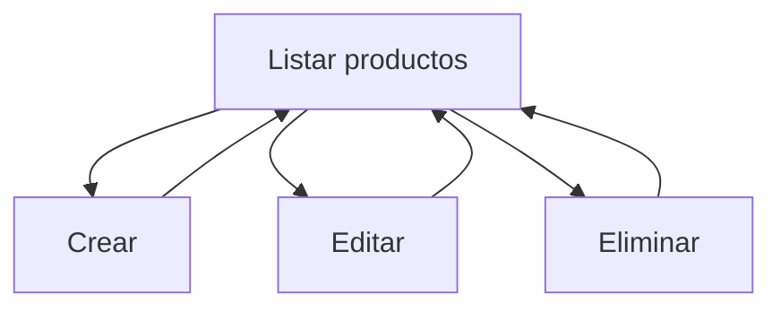

# 🛠️ Clase 06: CRUD Completo en Django

[🏠 Volver al índice](../README.md)
[⬅️ Clase anterior](../Clase_05_Modelos_y_Base_de_Datos/Clase_05_Modelos_y_Base_de_Datos.md) |
[➡️ Siguiente clase](../Clase_07_Autenticacion_y_Permisos/Clase_07_Autenticacion_y_Permisos.md)

## 🎯 Tema

Construcción de un módulo CRUD completo para productos.

## 🧭 Objetivo general

Implementar un flujo CRUD completo, estable y usable en Django para gestionar productos desde interfaz web.

## 🎯 Objetivos específicos

Al finalizar la clase, el estudiante podrá:

1. Construir vistas para listar, crear, editar y eliminar productos.
2. Usar `ModelForm` para captura y validación de datos.
3. Definir rutas CRUD claras y mantenibles.
4. Diseñar templates reutilizables para cada operación.
5. Mejorar UX con mensajes y confirmaciones.

## 🧠 Explicación

El patrón CRUD permite crear, consultar, editar y eliminar datos desde la interfaz web. Es la base de la mayoría de
aplicaciones administrativas.

Esta clase transforma los modelos de la Clase 5 en una funcionalidad real para usuarios finales.

## 🧱 Estructura de la clase

- **Objetivo:** completar el ciclo de vida de datos de `Producto`.
- **Conceptos clave:** vistas CRUD, formularios, templates, mensajes.
- **Práctica guiada:** listado + crear + editar + eliminar.
- **Reto:** mejorar validaciones y diseño.

## 🗂️ Contenido enriquecido de la Clase 6

- [📚 Glosario CRUD en Django](01_Glosario_CRUD_Django.md)
- [🧰 Estructura recomendada del proyecto CRUD](02_Estructura_Proyecto_CRUD.md)
- [🧪 Ejemplos paso a paso](03_Ejemplos_Paso_a_Paso_Clase_06.md)
- [🧩 Banco amplio de ejercicios](04_Ejercicios_Clase_06.md)
- [✅ Ejercicios resueltos (selección)](05_Ejercicios_Resueltos_Clase_06.md)
- [🧠 Reto guiado de clase](06_Reto_Guiado_Clase_06.md)
- [✅ Checklist técnico](07_Checklist_Tecnico_Clase_06.md)

## 📊 Gráfico conceptual



## 💻 Código de ejemplo

```python
from django.shortcuts import render, redirect, get_object_or_404
from .models import Producto
from .forms import ProductoForm

def producto_list(request):
    productos = Producto.objects.all()
    return render(request, 'productos/list.html', {'productos': productos})

def producto_create(request):
    form = ProductoForm(request.POST or None)
    if form.is_valid():
        form.save()
        return redirect('producto_list')
    return render(request, 'productos/form.html', {'form': form})
```

## 🧩 Definiciones rápidas (resumen)

- **Create:** crear nuevo registro.
- **Read:** listar/consultar registros.
- **Update:** editar registro existente.
- **Delete:** eliminar registro existente.
- **ModelForm:** formulario conectado al modelo para validar/guardar datos.

> Revisa definiciones más detalladas en el [glosario](01_Glosario_CRUD_Django.md).

## 🛠️ Práctica sugerida

1. Implementar las 4 vistas CRUD.
2. Crear templates base y herencia.
3. Mostrar mensajes de éxito/error.

## 🏋️ Práctica ampliada recomendada

- Resolver ejercicios **1 al 15** del [banco de ejercicios](04_Ejercicios_Clase_06.md).
- Resolver **8 ejercicios** del bloque intermedio.
- Resolver **4 ejercicios** del bloque desafío.
- Completar el [reto guiado](06_Reto_Guiado_Clase_06.md).
- Validar con el [checklist técnico](07_Checklist_Tecnico_Clase_06.md).

## ⏱️ Sugerencia de ritmo para 2 horas

- 20 min: arquitectura y flujo CRUD.
- 30 min: implementación list/create.
- 30 min: implementación update/delete.
- 40 min: templates, validaciones y pruebas.

## 🧪 Criterios de evaluación rápida

- **Funcionalidad CRUD completa (35%)**
- **Formularios y validaciones (25%)**
- **Estructura de URLs y templates (25%)**
- **UX y claridad del código (15%)**

## ✅ Checklist

- [ ] Listado funcional.
- [ ] Registro de producto funcional.
- [ ] Edición funcional.
- [ ] Eliminación funcional.
- [ ] Mensajes y validaciones implementados.
- [ ] Entrega validada con checklist técnico.

---

## 🚀 Entregable de la Clase 6

Subir módulo `productos` con:

1. Vistas CRUD completas.
2. Formulario `ModelForm` funcional.
3. Templates `list`, `form`, `confirm_delete`.
4. URLs correctamente enlazadas.
5. Evidencia de pruebas manuales del flujo completo.
