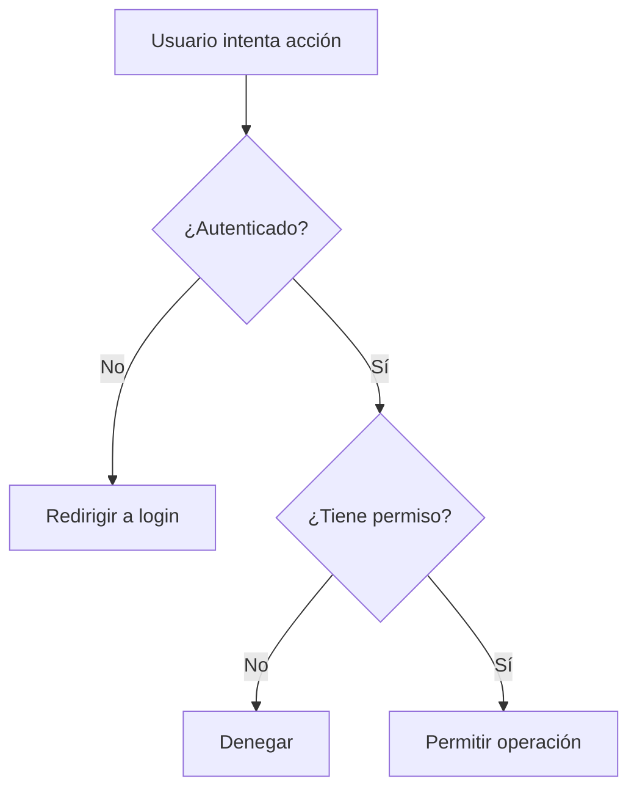

# 📚 Clase 07 · Glosario de Autenticación y Permisos

[⬅️ Volver a la clase](Clase_07_Autenticacion_y_Permisos.md) | [📦 Módulo](README.md) |
[🗺️ Mapa modular](../MAPA_MODULAR_COMPLETO.md) | [🏠 Índice general](../README.md)

## 1) Autenticación

Proceso para verificar la identidad de un usuario (quién es).

## 2) Autorización

Proceso para decidir qué acciones puede realizar un usuario autenticado.

## 3) `User` (modelo de usuario)

Modelo integrado de Django que representa cuentas de usuario.

## 4) Login

Inicio de sesión del usuario con credenciales válidas.

## 5) Logout

Cierre de sesión que elimina la sesión activa del usuario.

## 6) Sesión

Mecanismo para mantener al usuario autenticado entre peticiones HTTP.

## 7) `@login_required`

Decorador para restringir acceso a vistas solo a usuarios autenticados.

## 8) Permisos

Reglas para permitir o denegar operaciones.

Tipos comunes:

- Por autenticación (`is_authenticated`)
- Por rol/grupo
- Por propiedad de recurso (autor/creador)

## 9) Propiedad del recurso

Validación para que solo el dueño del objeto pueda editar/eliminar.

## 10) `request.user`

Usuario actual de la petición; permite verificar sesión y permisos.

## 11) `AuthenticationForm`

Formulario predefinido de Django para login.

## 12) `UserCreationForm`

Formulario predefinido para registro de usuarios.

## 13) Redirección por autenticación

Si no está autenticado, Django redirige al `LOGIN_URL`.

## 14) Errores frecuentes en esta clase

- Olvidar `@login_required` en vistas sensibles.
- No configurar `LOGIN_URL` y `LOGIN_REDIRECT_URL`.
- No validar propiedad del objeto.
- Renderizar formularios de auth sin manejo de errores.

## 15) Buenas prácticas

- Proteger por defecto las vistas críticas.
- Validar autenticación + propiedad para operaciones de edición/eliminación.
- Usar mensajes claros para denegaciones de acceso.
- Evitar lógica de permisos duplicada.

## 🗺️ Mapa conceptual

