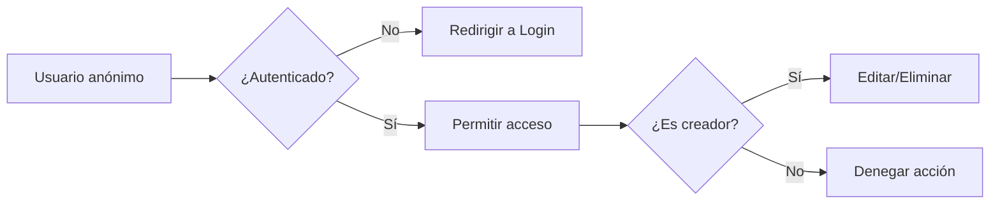

# 🔐 Clase 07: Autenticación y Permisos

[🏠 Volver al índice](../README.md) [⬅️ Clase anterior](../Clase_06_CRUD_Completo/Clase_06_CRUD_Completo.md) |
[➡️ Siguiente clase](../Clase_08_Buenas_Practicas/Clase_08_Buenas_Practicas.md)

## 🎯 Tema

Control de acceso con usuarios autenticados y permisos básicos.

## 🧭 Objetivo general

Proteger el sistema CRUD con autenticación y autorización básica para garantizar que cada usuario solo pueda ejecutar
acciones permitidas.

## 🎯 Objetivos específicos

Al finalizar la clase, el estudiante podrá:

1. Implementar login, registro y logout.
2. Restringir vistas con `@login_required`.
3. Asignar y validar propietario de recursos.
4. Aplicar reglas de edición/eliminación por usuario creador.
5. Mejorar experiencia de seguridad con mensajes y redirecciones.

## 🧠 Explicación

La autenticación valida identidad (quién eres). Los permisos validan autorización (qué puedes hacer). Esto protege datos
y funcionalidades críticas.

Esta clase convierte tu CRUD en una aplicación con reglas reales de acceso y seguridad básica.

## 🧱 Estructura de la clase

- **Objetivo:** restringir operaciones según el estado del usuario.
- **Conceptos clave:** `User`, login/logout, registro, `@login_required`.
- **Práctica guiada:** solo autenticados crean productos.
- **Reto:** solo el creador puede editar/eliminar.

## 🗂️ Contenido enriquecido de la Clase 7

- [📚 Glosario de autenticación y permisos](01_Glosario_Autenticacion_y_Permisos.md)
- [🧰 Flujo de implementación auth](02_Flujo_Implementacion_Auth.md)
- [🧪 Ejemplos paso a paso](03_Ejemplos_Paso_a_Paso_Clase_07.md)
- [🧩 Banco amplio de ejercicios](04_Ejercicios_Clase_07.md)
- [✅ Ejercicios resueltos (selección)](05_Ejercicios_Resueltos_Clase_07.md)
- [🧠 Reto guiado de clase](06_Reto_Guiado_Clase_07.md)
- [✅ Checklist técnico](07_Checklist_Tecnico_Clase_07.md)

## 📊 Gráfico conceptual



## 💻 Código de ejemplo

```python
from django.contrib.auth.decorators import login_required
from django.http import HttpResponseForbidden

@login_required
def producto_update(request, pk):
    producto = get_object_or_404(Producto, pk=pk)
    if producto.creado_por != request.user:
        return HttpResponseForbidden("No autorizado 🚫")
    # lógica de edición...
```

## 🧩 Definiciones rápidas (resumen)

- **Autenticación:** verificar identidad del usuario.
- **Autorización:** definir qué puede hacer el usuario.
- **Sesión:** estado de usuario logueado entre peticiones.
- **Permiso por propietario:** solo el autor del recurso puede modificarlo.
- **`@login_required`:** bloquea acceso a usuarios anónimos.

> Puedes profundizar todos los conceptos en el [glosario](01_Glosario_Autenticacion_y_Permisos.md).

## 🛠️ Práctica sugerida

1. Crear vistas de login y logout.
2. Proteger vista de creación.
3. Validar propietario en edición/eliminación.

## 🏋️ Práctica ampliada recomendada

- Resolver ejercicios **1 al 15** del [banco de ejercicios](04_Ejercicios_Clase_07.md).
- Resolver **8 ejercicios** del bloque intermedio.
- Resolver **4 ejercicios** del bloque desafío.
- Completar el [reto guiado](06_Reto_Guiado_Clase_07.md).
- Validar con el [checklist técnico](07_Checklist_Tecnico_Clase_07.md).

## ⏱️ Sugerencia de ritmo para 2 horas

- 25 min: conceptos de autenticación/autorización.
- 30 min: login, registro y logout.
- 35 min: permisos por propietario sobre CRUD.
- 30 min: pruebas con varios usuarios + revisión.

## 🧪 Criterios de evaluación rápida

- **Auth funcional (30%)**
- **Protección de vistas (25%)**
- **Permisos por propietario (30%)**
- **UX de seguridad y claridad (15%)**

## ✅ Checklist

- [ ] Login y logout funcionando.
- [ ] Vistas protegidas correctamente.
- [ ] Permisos por propietario aplicados.
- [ ] No hay accesos no autorizados.
- [ ] Registro funcional y probado.
- [ ] Entrega validada con checklist técnico.

---

## 🚀 Entregable de la Clase 7

Subir módulo de autenticación y permisos con:

1. Login, registro y logout funcionales.
2. CRUD protegido con `@login_required`.
3. Restricción de edición/eliminación por propietario.
4. Navegación adaptada según sesión.
5. Evidencia de pruebas con dos usuarios distintos.
