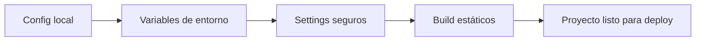

# 📚 Clase 08 · Glosario de Buenas Prácticas en Producción

[⬅️ Volver a la clase](Clase_08_Buenas_Practicas.md) | [📦 Módulo](README.md) |
[🗺️ Mapa modular](../MAPA_MODULAR_COMPLETO.md) | [🏠 Índice general](../README.md)

## 1) Entorno de desarrollo vs producción

- **Desarrollo:** ambiente local para programar y probar.
- **Producción:** ambiente real donde acceden usuarios.

## 2) `DEBUG`

- `True` en desarrollo para depuración.
- `False` en producción para evitar exposición de errores internos.

## 3) `SECRET_KEY`

Clave crítica para seguridad de sesiones y firmas. Nunca debe estar hardcodeada en repositorio público.

## 4) Variables de entorno

Valores configurables fuera del código (`.env`, panel cloud, sistema operativo).

## 5) `ALLOWED_HOSTS`

Lista de dominios válidos para servir la aplicación en producción.

## 6) `requirements.txt`

Archivo con dependencias y versiones del proyecto para instalación reproducible.

## 7) Archivos estáticos (`static`)

CSS, JS e imágenes del frontend.

## 8) Archivos media (`media`)

Archivos subidos por usuarios (fotos, documentos, etc.).

## 9) `collectstatic`

Comando para reunir estáticos en una carpeta lista para servir en producción.

## 10) Whitenoise (opcional común)

Paquete para servir estáticos en despliegues simples de Django.

## 11) Configuración segura mínima

- `DEBUG=False`
- `SECRET_KEY` por entorno
- `ALLOWED_HOSTS` correcto
- Dependencias controladas

## 12) Errores frecuentes

- Dejar `DEBUG=True` en producción.
- Publicar `.env` en Git.
- No configurar hosts permitidos.
- No ejecutar `collectstatic` antes de deploy.

## 13) Buenas prácticas esenciales

- Separar configuración por entorno.
- Versionar dependencias.
- Minimizar secretos en código.
- Validar configuración antes del despliegue.

## 🗺️ Mapa conceptual

