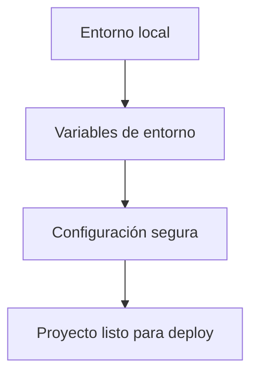

# ⚙️ Clase 08: Buenas Prácticas para Producción

[🏠 Volver al índice](../README.md)
[⬅️ Clase anterior](../Clase_07_Autenticacion_y_Permisos/Clase_07_Autenticacion_y_Permisos.md) |
[➡️ Siguiente clase](../Clase_09_Deploy_del_Proyecto/Clase_09_Deploy_del_Proyecto.md)

## 🎯 Tema

Configuración segura y ordenada del proyecto antes del despliegue.

## 🧭 Objetivo general

Preparar el proyecto Django con configuración segura, ordenada y reproducible para que pueda pasar de desarrollo a
producción sin riesgos básicos evitables.

## 🎯 Objetivos específicos

Al finalizar la clase, el estudiante podrá:

1. Separar secretos y configuración sensible del código.
2. Configurar `DEBUG`, `SECRET_KEY` y `ALLOWED_HOSTS` correctamente.
3. Preparar manejo de estáticos y media para producción.
4. Generar y validar dependencias con `requirements.txt`.
5. Ejecutar chequeos de seguridad previos al deploy.

## 🧠 Explicación

En desarrollo puedes usar configuraciones flexibles, pero en producción necesitas seguridad, orden y control de
dependencias para evitar errores y fugas de información.

Esta clase reduce riesgos operativos y prepara la base para desplegar con mayor confianza en la Clase 9.

## 🧱 Estructura de la clase

- **Objetivo:** dejar el proyecto listo para salir a producción.
- **Conceptos clave:** variables de entorno, `DEBUG=False`, `SECRET_KEY`, estáticos/media, `requirements.txt`.
- **Práctica guiada:** separar configuración sensible.
- **Reto:** checklist completo de preparación.

## 🗂️ Contenido enriquecido de la Clase 8

- [📚 Glosario de buenas prácticas de producción](01_Glosario_Buenas_Practicas_Produccion.md)
- [🧰 Guía de settings seguros](02_Guia_Settings_Seguros.md)
- [🧪 Ejemplos paso a paso](03_Ejemplos_Paso_a_Paso_Clase_08.md)
- [🧩 Banco amplio de ejercicios](04_Ejercicios_Clase_08.md)
- [✅ Ejercicios resueltos (selección)](05_Ejercicios_Resueltos_Clase_08.md)
- [🧠 Reto guiado de clase](06_Reto_Guiado_Clase_08.md)
- [✅ Checklist técnico](07_Checklist_Tecnico_Clase_08.md)

## 📊 Gráfico conceptual



## 💻 Código de ejemplo

```python
# settings.py (ejemplo)
import os
from pathlib import Path

BASE_DIR = Path(__file__).resolve().parent.parent
DEBUG = os.getenv("DEBUG", "False") == "True"
SECRET_KEY = os.getenv("SECRET_KEY", "cambiar-en-produccion")
ALLOWED_HOSTS = os.getenv("ALLOWED_HOSTS", "127.0.0.1,localhost").split(",")
```

## 🧩 Definiciones rápidas (resumen)

- **Variable de entorno:** valor de configuración externo al código.
- **Hardening básico:** conjunto de medidas mínimas para reducir riesgos.
- **Static files:** recursos frontend del proyecto.
- **Media files:** archivos subidos por usuarios.
- **Check deploy:** validación automática de configuración de seguridad.

> Puedes ampliar estos conceptos en el [glosario](01_Glosario_Buenas_Practicas_Produccion.md).

## 🛠️ Práctica sugerida

1. Crear archivo `.env` local.
2. Configurar `DEBUG=False` en entorno productivo.
3. Generar y revisar `requirements.txt`.

## 🏋️ Práctica ampliada recomendada

- Resolver ejercicios **1 al 15** del [banco de ejercicios](04_Ejercicios_Clase_08.md).
- Resolver **8 ejercicios** del bloque intermedio.
- Resolver **4 ejercicios** del bloque desafío.
- Completar el [reto guiado](06_Reto_Guiado_Clase_08.md).
- Validar todo con el [checklist técnico](07_Checklist_Tecnico_Clase_08.md).

## ⏱️ Sugerencia de ritmo para 2 horas

- 20 min: fundamentos de seguridad y configuración.
- 30 min: settings con variables de entorno.
- 30 min: static/media y dependencias.
- 40 min: ejercicios, checks y cierre técnico.

## 🧪 Criterios de evaluación rápida

- **Configuración segura base (35%)**
- **Separación entorno/código (25%)**
- **Preparación de deploy (25%)**
- **Documentación técnica mínima (15%)**

## ✅ Checklist

- [ ] Variables sensibles fuera del código.
- [ ] DEBUG desactivado en producción.
- [ ] Dependencias actualizadas.
- [ ] Archivos estáticos configurados.
- [ ] Chequeo `check --deploy` ejecutado.
- [ ] Entrega validada con checklist técnico.

---

## 🚀 Entregable de la Clase 8

Subir configuración de proyecto lista para producción con:

1. Variables de entorno definidas.
2. `settings` endurecido para deploy.
3. `requirements.txt` actualizado.
4. Static/media configurados.
5. Evidencia de chequeos técnicos ejecutados.
