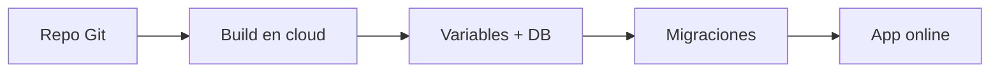

# 📚 Clase 09 · Glosario de Deploy en Django

[⬅️ Volver a la clase](Clase_09_Deploy_del_Proyecto.md) | [📦 Módulo](README.md) |
[🗺️ Mapa modular](../MAPA_MODULAR_COMPLETO.md) | [🏠 Índice general](../README.md)

## 1) Deploy

Proceso de publicar una aplicación para que esté disponible en internet.

## 2) Hosting / Plataforma cloud

Servicio donde corre tu aplicación (Render, Railway, PythonAnywhere, etc.).

## 3) Repositorio remoto

Código almacenado en GitHub/GitLab/Bitbucket para versionar y desplegar.

## 4) Build

Fase donde se instalan dependencias y se prepara la app para ejecución.

## 5) Runtime

Entorno donde la app se ejecuta (Python + servidor web + variables de entorno).

## 6) `requirements.txt`

Lista de dependencias necesarias para instalar el proyecto en producción.

## 7) `Procfile`

Archivo que define cómo arrancar la app en ciertas plataformas.

```txt
web: gunicorn proyecto.wsgi
```

## 8) Variables de entorno

Configuraciones sensibles o específicas de entorno (SECRET_KEY, DB_URL, etc.).

## 9) Base de datos en producción

Motor de datos usado en cloud (frecuente: PostgreSQL).

## 10) Migraciones en producción

Aplicación de cambios de modelo en la base remota con `python manage.py migrate`.

## 11) Dominio / URL pública

Dirección web final para acceder a la app desplegada.

## 12) Logs

Registros de ejecución para depurar errores de arranque o runtime.

## 13) Errores frecuentes de deploy

- Variables incompletas en cloud.
- `ALLOWED_HOSTS` mal configurado.
- Falta de `gunicorn` en dependencias.
- Migraciones no ejecutadas.
- Static files sin configurar.

## 14) Buenas prácticas de deploy

- Deploy incremental y verificable.
- Revisar logs después de cada despliegue.
- Mantener README técnico actualizado.
- Separar secretos del código siempre.

## 🗺️ Mapa conceptual


