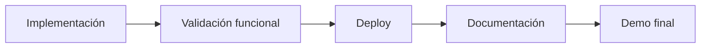

# 📚 Clase 10 · Glosario del Proyecto Final

[⬅️ Volver a la clase](Clase_10_Proyecto_Final.md) | [📦 Módulo](README.md) |
[🗺️ Mapa modular](../MAPA_MODULAR_COMPLETO.md) | [🏠 Índice general](../README.md)

## 1) Proyecto integrador

Trabajo que reúne todas las competencias del curso en una sola aplicación funcional.

## 2) MVP (Producto Mínimo Viable)

Versión más pequeña del proyecto que ya entrega valor real y cumple objetivos esenciales.

## 3) Alcance funcional

Conjunto de funcionalidades obligatorias que debe cumplir el proyecto.

## 4) Entregable

Resultado tangible del trabajo (código, demo, URL, documentación).

## 5) Criterios de aceptación

Condiciones mínimas para considerar el proyecto como aprobado.

## 6) Demo

Presentación práctica del funcionamiento del sistema frente al evaluador.

## 7) Defensa técnica

Explicación de decisiones de diseño, arquitectura y solución de problemas.

## 8) Evidencia

Pruebas de funcionamiento: capturas, videos, logs, URL pública, commits.

## 9) Calidad de código

Legibilidad, modularidad, consistencia y mantenibilidad del proyecto.

## 10) Deuda técnica

Decisiones rápidas que funcionan ahora, pero requerirán mejora futura.

## 11) Riesgo de entrega

Factor que puede impedir terminar a tiempo (errores de deploy, alcance excesivo, etc.).

## 12) Cierre de proyecto

Etapa final donde se valida funcionalidad, documentación y presentación.

## 13) Buenas prácticas de cierre

- Priorizar estabilidad sobre nuevas funciones.
- Corregir errores críticos primero.
- Documentar claramente el arranque del proyecto.
- Ensayar demo antes de entregar.

## 🗺️ Mapa conceptual del cierre

