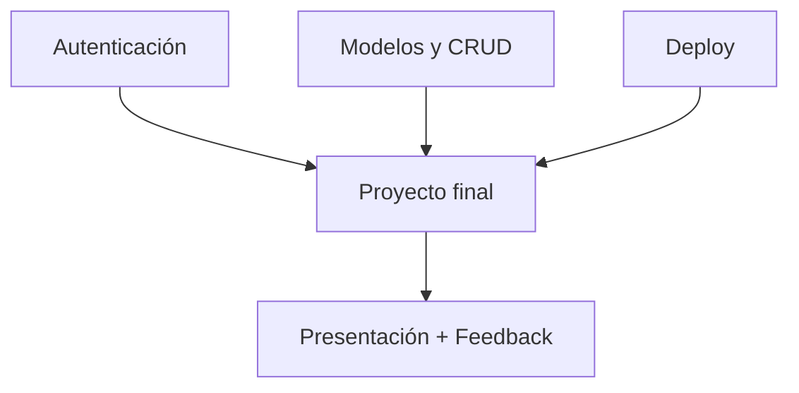

# 🏁 Clase 10: Proyecto Final Integrador

[🏠 Volver al índice](../README.md) [⬅️ Clase anterior](../Clase_09_Deploy_del_Proyecto/Clase_09_Deploy_del_Proyecto.md)
| [➡️ Siguiente clase](../Clase_11_IA_y_Prompt_Engineering/Clase_11_IA_y_Prompt_Engineering.md)

## 🎯 Tema

Integración de todo lo aprendido en un producto real.

## 🧭 Objetivo general

Consolidar todas las competencias del curso en un proyecto Django completo, funcional, desplegado y bien documentado.

## 🎯 Objetivos específicos

Al finalizar la clase, el estudiante podrá:

1. Entregar un sistema funcional de extremo a extremo.
2. Demostrar dominio técnico de arquitectura, CRUD y seguridad.
3. Publicar y validar el proyecto en producción.
4. Documentar correctamente el proyecto para uso y evaluación.
5. Presentar y defender decisiones técnicas en una demo final.

## 🧠 Explicación

Esta clase consolida competencias técnicas y de presentación profesional. El objetivo no es solo que funcione, sino que
esté ordenado, documentado y desplegado.

Es el cierre del proceso formativo: construir, validar, publicar y comunicar resultados de manera profesional.

## 🧱 Estructura de la clase

- **Objetivo:** presentar una aplicación completa en producción.
- **Alcance mínimo:** usuarios, productos, categorías, autenticación, CRUD, deploy.
- **Práctica guiada:** ajustes finales + prueba de flujo completo.
- **Reto:** demo final de 5 a 10 minutos.

## 🗂️ Contenido enriquecido de la Clase 10

- [📚 Glosario del proyecto final](01_Glosario_Proyecto_Final.md)
- [🧰 Guía del proyecto final paso a paso](02_Guia_Proyecto_Final_Paso_a_Paso.md)
- [📝 Plantilla README para entrega](03_Plantilla_README_Proyecto_Final.md)
- [🧩 Ejercicios de cierre](04_Ejercicios_Cierre_Clase_10.md)
- [📊 Rúbrica detallada de evaluación](05_Rubrica_Detallada_Clase_10.md)
- [🧠 Reto guiado de defensa final](06_Reto_Guiado_Clase_10.md)
- [✅ Checklist técnico final](07_Checklist_Tecnico_Clase_10.md)
- [🎤 Preguntas de defensa del proyecto](08_Preguntas_Defensa_Proyecto.md)

## 📊 Gráfico conceptual



## 💻 Código de ejemplo (consulta final)

```python
from django.contrib.auth.models import User
from app.models import Producto, Categoria

print("Usuarios:", User.objects.count())
print("Categorías:", Categoria.objects.count())
print("Productos:", Producto.objects.count())
```

## 🧩 Definiciones rápidas (resumen)

- **Proyecto integrador:** solución que une todas las clases del curso.
- **MVP:** versión mínima completa y funcional.
- **Defensa técnica:** explicación razonada de decisiones de implementación.
- **Evidencia:** prueba concreta de funcionamiento y despliegue.
- **Cierre profesional:** entrega técnica + comunicación efectiva.

> Revisa el detalle en el [glosario](01_Glosario_Proyecto_Final.md).

## 🛠️ Entregables

1. Repositorio con README claro.
2. URL pública funcional.
3. Video o demostración en vivo.
4. Checklist de funcionalidades completado.

## 🏋️ Práctica ampliada recomendada

- Resolver el [repertorio de cierre](04_Ejercicios_Cierre_Clase_10.md).
- Completar el [reto guiado](06_Reto_Guiado_Clase_10.md).
- Verificar avance con el [checklist técnico final](07_Checklist_Tecnico_Clase_10.md).
- Ensayar la presentación con apoyo de [preguntas de defensa](08_Preguntas_Defensa_Proyecto.md).

## ⏱️ Sugerencia de ritmo para 2 horas

- 30 min: estabilización final de funcionalidades.
- 25 min: validación técnica y checklist.
- 25 min: revisión de documentación.
- 40 min: ensayo de demo y defensa.

## ✅ Rúbrica rápida (sugerida)

- **Funcionalidad (40%)**
- **Código y estructura (25%)**
- **UI/UX básica (15%)**
- **Deploy y documentación (20%)**

## 📌 Evaluación detallada

Para evaluación completa usa la [rúbrica detallada](05_Rubrica_Detallada_Clase_10.md).

---

## 🚀 Entregable final del curso

Entrega completa compuesta por:

1. Código fuente en repositorio remoto.
2. URL de producción operativa.
3. README técnico estructurado.
4. Evidencias de prueba funcional.
5. Presentación final con defensa técnica.

## 🎉 Cierre

¡Felicitaciones! Si llegaste aquí, ya tienes una ruta real para construir y publicar proyectos con Python + Django.
