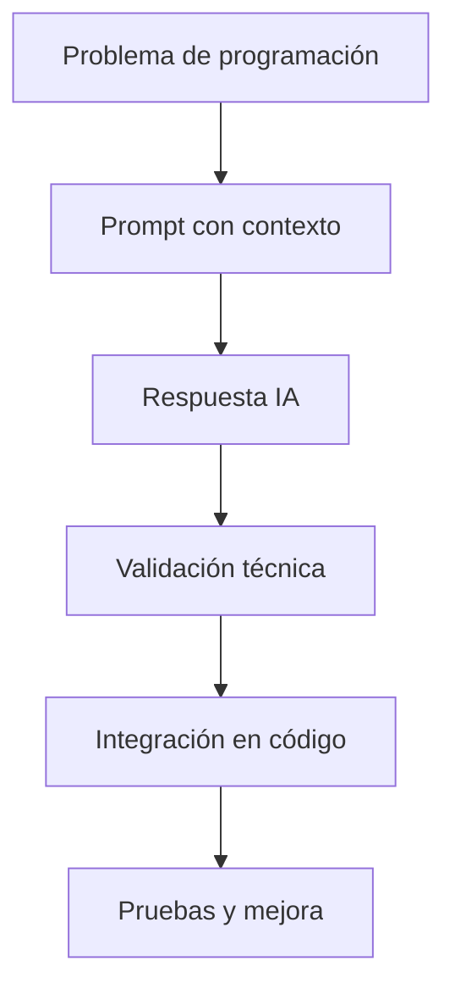

# 🤖 Clase 11: IA para Programación y Prompt Engineering

[🏠 Volver al índice](../README.md) [⬅️ Clase anterior](../Clase_10_Proyecto_Final/Clase_10_Proyecto_Final.md)

## 🎯 Tema

Uso estratégico de IA en programación: prompts efectivos, validación técnica y buenas prácticas.

## 🧭 Objetivo general

Aprender a usar IA como copiloto técnico para analizar, escribir, depurar y documentar código con criterio profesional.

## 🎯 Objetivos específicos

Al finalizar la clase, el estudiante podrá:

1. Explicar por qué Python es clave en IA y automatización.
2. Diseñar prompts claros para tareas de programación.
3. Mejorar respuestas con contexto, restricciones y formato esperado.
4. Validar resultados generados por IA antes de integrarlos.
5. Construir un flujo práctico IA + Python para productividad real.

## 🧠 Explicación

La IA no reemplaza el pensamiento técnico: lo acelera. Su mayor valor aparece cuando el desarrollador define bien el
problema, entrega contexto útil y evalúa críticamente la salida.

Python es fundamental porque domina el ecosistema de datos, automatización, IA aplicada y scripting. Combinar Python con
prompt engineering permite construir soluciones más rápido, sin perder calidad.

## 🧱 Estructura de la clase

- **Bloque 1:** IA en desarrollo de software (qué sí y qué no delegar).
- **Bloque 2:** Anatomía de un buen prompt técnico.
- **Bloque 3:** Casos reales con Python (debug, refactor, tests, documentación).
- **Bloque 4:** Validación, riesgos y checklist de calidad.

## 🗂️ Contenido enriquecido de la Clase 11

- [📚 Glosario IA + Prompt Engineering](01_Glosario_IA_y_Prompt_Engineering.md)
- [🧰 Guía de prompts para programación](02_Guia_Prompts_para_Programacion.md)
- [💻 Ejemplos prácticos en flujo de desarrollo](03_Ejemplos_IA_en_Flujo_Desarrollo.md)
- [🧩 Repertorio de ejercicios](04_Ejercicios_Clase_11.md)
- [✅ Ejercicios resueltos](05_Ejercicios_Resueltos_Clase_11.md)
- [🧠 Reto guiado](06_Reto_Guiado_Clase_11.md)
- [📋 Checklist técnico de uso responsable](07_Checklist_Tecnico_Clase_11.md)

## 📊 Gráfico conceptual



## 💻 Código de ejemplo

```python
def construir_prompt_bug(contexto, error, objetivo):
    return f"""
Actúa como mentor Python senior.
Contexto del proyecto: {contexto}
Error observado: {error}
Objetivo: {objetivo}

Entrega:
1) Causa probable
2) Solución mínima
3) Ejemplo de código corregido
4) Prueba rápida para validar
""".strip()

prompt = construir_prompt_bug(
    contexto="API Django con endpoint /productos/",
    error="KeyError: 'precio' en serializer",
    objetivo="evitar caída cuando falta precio en payload"
)

print(prompt)
```

## 🏋️ Práctica recomendada

1. Escribir un prompt para depurar un error real.
2. Escribir otro prompt para refactorizar una función larga.
3. Validar ambas salidas con pruebas mínimas.
4. Registrar en README qué parte fue asistida por IA.

## ✅ Criterio de logro

El estudiante diseña prompts útiles, obtiene resultados técnicos aplicables y valida el código generado con criterio
profesional.
