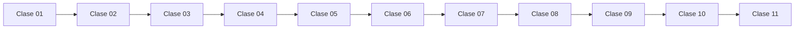

# 🗺️ Mapa Modular Completo del Curso

[🏠 Volver al índice general](README.md)

## Navegación por clase (modo modular)

- [Clase 01 · Módulo completo](Clase_01_Fundamentos_Python/README.md)
- [Clase 02 · Módulo completo](Clase_02_Estructuras_y_Funciones/README.md)
- [Clase 03 · Módulo completo](Clase_03_POO_en_Python/README.md)
- [Clase 04 · Módulo completo](Clase_04_Introduccion_Django/README.md)
- [Clase 05 · Módulo completo](Clase_05_Modelos_y_Base_de_Datos/README.md)
- [Clase 06 · Módulo completo](Clase_06_CRUD_Completo/README.md)
- [Clase 07 · Módulo completo](Clase_07_Autenticacion_y_Permisos/README.md)
- [Clase 08 · Módulo completo](Clase_08_Buenas_Practicas/README.md)
- [Clase 09 · Módulo completo](Clase_09_Deploy_del_Proyecto/README.md)
- [Clase 10 · Módulo completo](Clase_10_Proyecto_Final/README.md)
- [Clase 11 · Módulo completo](Clase_11_IA_y_Prompt_Engineering/README.md)

## Vista rápida de progresión

