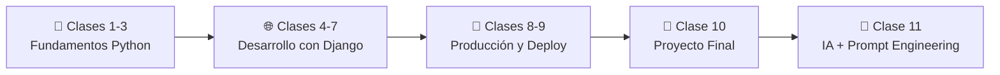

# 📘 Curso Python + Django en 11 Clases

Bienvenido/a al material del curso. Aquí encontrarás una clase por archivo con estructura clara, explicación, práctica y
recursos visuales.

## 🧭 Accesos principales

- [Mapa modular completo](MAPA_MODULAR_COMPLETO.md)
- [Navegación por clases principales](#-navegación-rápida)
- Navegación modular por carpeta (ver sección inferior)

## 🧭 Navegación rápida

- [Clase 01 - Fundamentos de Python](Clase_01_Fundamentos_Python/Clase_01_Fundamentos_Python.md)
- [Clase 02 - Estructuras y Funciones](Clase_02_Estructuras_y_Funciones/Clase_02_Estructuras_y_Funciones.md)
- [Clase 03 - POO en Python](Clase_03_POO_en_Python/Clase_03_POO_en_Python.md)
- [Clase 04 - Introducción a Django](Clase_04_Introduccion_Django/Clase_04_Introduccion_Django.md)
- [Clase 05 - Modelos y Base de Datos](Clase_05_Modelos_y_Base_de_Datos/Clase_05_Modelos_y_Base_de_Datos.md)
- [Clase 06 - CRUD Completo](Clase_06_CRUD_Completo/Clase_06_CRUD_Completo.md)
- [Clase 07 - Autenticación y Permisos](Clase_07_Autenticacion_y_Permisos/Clase_07_Autenticacion_y_Permisos.md)
- [Clase 08 - Buenas Prácticas](Clase_08_Buenas_Practicas/Clase_08_Buenas_Practicas.md)
- [Clase 09 - Deploy del Proyecto](Clase_09_Deploy_del_Proyecto/Clase_09_Deploy_del_Proyecto.md)
- [Clase 10 - Proyecto Final](Clase_10_Proyecto_Final/Clase_10_Proyecto_Final.md)
- [Clase 11 - IA y Prompt Engineering](Clase_11_IA_y_Prompt_Engineering/Clase_11_IA_y_Prompt_Engineering.md)

## 🗂️ Navegación modular por carpeta

- [Clase 01 - Módulo completo](Clase_01_Fundamentos_Python/README.md)
- [Clase 02 - Módulo completo](Clase_02_Estructuras_y_Funciones/README.md)
- [Clase 03 - Módulo completo](Clase_03_POO_en_Python/README.md)
- [Clase 04 - Módulo completo](Clase_04_Introduccion_Django/README.md)
- [Clase 05 - Módulo completo](Clase_05_Modelos_y_Base_de_Datos/README.md)
- [Clase 06 - Módulo completo](Clase_06_CRUD_Completo/README.md)
- [Clase 07 - Módulo completo](Clase_07_Autenticacion_y_Permisos/README.md)
- [Clase 08 - Módulo completo](Clase_08_Buenas_Practicas/README.md)
- [Clase 09 - Módulo completo](Clase_09_Deploy_del_Proyecto/README.md)
- [Clase 10 - Módulo completo](Clase_10_Proyecto_Final/README.md)
- [Clase 11 - Módulo completo](Clase_11_IA_y_Prompt_Engineering/README.md)

## 🗺️ Mapa visual del curso

## ✅ Recomendación de uso

1. Lee el objetivo de la clase.
2. Estudia el tema y la explicación.
3. Ejecuta el código de ejemplo.
4. Completa la práctica y la tarea.
5. Avanza a la siguiente clase desde los enlaces.
