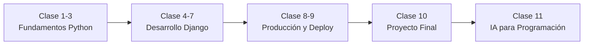

# Curso Integral: Python + Django + Deploy + IA (11 Clases)

<!-- markdownlint-configure-file {"MD024": {"siblings_only": true}, "MD060": false} -->

> Ruta diseñada para pasar de **cero** a **proyecto real en producción**.

## 1) Vista General del Curso

**Duración por clase:** 2 horas  
**Modalidad sugerida:** 40% teoría · 60% práctica  
**Formato recomendado:** explicación breve + código guiado + reto  
**Proyecto final:** sistema CRUD con autenticación y despliegue

### Perfil de entrada

- Estudiante sin experiencia o con base mínima en programación.
- Manejo básico de computador y navegación web.

### Resultado final esperado

Al terminar el curso, el estudiante podrá:

1. Programar en Python con buena lógica.
2. Modelar soluciones con Programación Orientada a Objetos.
3. Construir aplicaciones web en Django.
4. Implementar autenticación y permisos básicos.
5. Preparar y desplegar un proyecto en producción.

---

## 2) Mapa del Curso (Progresión)

| Clase | Nivel       | Enfoque principal        | Entregable                    |
| ----- | ----------- | ------------------------ | ----------------------------- |
| 1     | Base        | Lógica + sintaxis Python | Mini programas de consola     |
| 2     | Base        | Estructuras + funciones  | CRUD en memoria               |
| 3     | Base        | POO aplicada             | Sistema orientado a objetos   |
| 4     | Web         | Django inicial           | Sitio con páginas estáticas   |
| 5     | Web         | Modelos + ORM            | Modelos con relación          |
| 6     | Web         | CRUD completo            | Módulo de productos funcional |
| 7     | Web         | Auth + permisos          | Acceso protegido por usuario  |
| 8     | Profesional | Configuración segura     | Proyecto listo para deploy    |
| 9     | Profesional | Publicación              | App desplegada online         |
| 10    | Cierre      | Integración total        | Proyecto final presentado     |
| 11    | Futuro      | IA aplicada a desarrollo | Flujo IA + Python profesional |

---

## 3) Estructura Pedagógica por Clase

Cada clase sigue este bloque:

- **Apertura (10 min):** repaso corto + objetivo del día.
- **Teoría guiada (35 min):** conceptos esenciales.
- **Práctica acompañada (55 min):** construcción en vivo.
- **Cierre (20 min):** retroalimentación + tarea + checklist.

---

## Clase 1 — Fundamentos de Programación con Python

### Objetivo

Comprender la lógica básica y escribir los primeros programas funcionales.

### Contenidos

- ¿Qué es Python y para qué se usa?
- Instalación: Python + VS Code.
- `print()`, `input()`.
- Variables y tipos (`int`, `float`, `str`, `bool`).
- Operadores aritméticos y lógicos.
- Condicionales: `if`, `elif`, `else`.

### Práctica guiada

1. Calculadora básica (suma, resta, multiplicación, división).
2. Validador de edad.
3. Menú interactivo en consola.

### Tarea

Simular un cajero automático simple:

- Consultar saldo.
- Depositar.
- Retirar con validaciones.

### Criterio de logro

El estudiante toma datos por consola, valida condiciones y muestra resultados correctos.

---

## Clase 2 — Estructuras de Datos y Funciones

### Objetivo

Dominar estructuras básicas y reutilizar código con funciones.

### Contenidos

- Listas, tuplas y diccionarios.
- Bucles `for` y `while`.
- Funciones, parámetros y `return`.
- Separación de responsabilidades en el código.

### Práctica guiada

Sistema de usuarios en memoria con operaciones:

- Crear usuario.
- Listar usuarios.
- Editar usuario.
- Eliminar usuario.

### Tarea

Construir CRUD en consola usando listas y funciones modulares.

### Criterio de logro

El estudiante organiza su código en funciones limpias y evita repetición innecesaria.

---

## Clase 3 — Programación Orientada a Objetos (POO)

### Objetivo

Modelar problemas reales con clases y objetos.

### Contenidos

- Clase y objeto.
- Constructor `__init__`.
- Atributos y métodos.
- `self`.
- Encapsulamiento básico.

### Práctica guiada

Implementar clases:

- `Usuario`
- `Producto`
- `Pedido`

Con relaciones simples entre ellas.

### Tarea

Sistema en consola orientado a objetos para gestionar pedidos.

### Criterio de logro

El estudiante identifica entidades del problema y las transforma en clases coherentes.

---

## Clase 4 — Introducción a Django

### Objetivo

Entender la arquitectura de Django y crear una primera app web.

### Contenidos

- ¿Qué es Django?
- MVC vs MVT.
- Crear proyecto y aplicación.
- Estructura de carpetas.
- `runserver`.
- Vistas y `urls.py`.

### Práctica guiada

Crear páginas:

- Inicio
- Acerca de
- Contacto

### Tarea

Agregar una vista personalizada adicional con su URL.

### Criterio de logro

El estudiante levanta su proyecto, crea rutas y responde con vistas correctamente.

---

## Clase 5 — Modelos y Base de Datos con ORM

### Objetivo

Persistir datos con modelos Django y administrar información desde el panel admin.

### Contenidos

- `models.py` y campos básicos.
- Relaciones entre modelos (ForeignKey).
- Migraciones (`makemigrations`, `migrate`).
- SQLite.
- Django Admin.

### Práctica guiada

Modelos:

- `Categoria`
- `Producto` (relacionado con categoría)

### Tarea

Agregar un modelo relacionado extra (ejemplo: Proveedor o Marca).

### Criterio de logro

El estudiante crea, migra y visualiza datos en el admin sin errores.

---

## Clase 6 — CRUD Completo en Django

### Objetivo

Construir un módulo funcional con operaciones Create, Read, Update, Delete.

### Contenidos

- Flujo CRUD completo.
- Formularios en Django.
- Herencia de templates.
- Integración visual básica con Bootstrap.

### Práctica guiada

CRUD de productos:

- Listado
- Registro
- Edición
- Eliminación

### Tarea

Mejorar diseño y validaciones de formularios.

### Criterio de logro

El estudiante completa todo el ciclo de vida de datos desde interfaz web.

---

## Clase 7 — Autenticación y Permisos

### Objetivo

Restringir acceso y proteger funcionalidades sensibles.

### Contenidos

- Modelo `User` de Django.
- Registro, login y logout.
- Decorador `@login_required`.
- Permisos básicos por usuario.

### Práctica guiada

Restringir creación de productos a usuarios autenticados.

### Tarea

Permitir editar/eliminar solo al usuario creador.

### Criterio de logro

El estudiante implementa control de acceso y evita acciones no autorizadas.

---

## Clase 8 — Buenas Prácticas para Producción

### Objetivo

Preparar el proyecto con configuración segura y mantenible.

### Contenidos

- Organización de `settings.py`.
- Variables de entorno.
- `DEBUG=False` y manejo de `SECRET_KEY`.
- Archivos estáticos y media.
- `requirements.txt`.

### Práctica guiada

Dejar el proyecto listo para despliegue con configuración profesional.

### Criterio de logro

El estudiante comprende diferencias entre entorno local y producción.

---

## Clase 9 — Deploy del Proyecto

### Objetivo

Publicar la aplicación para acceso público en internet.

### Contenidos

- Git básico y repositorio remoto.
- Dependencias del proyecto.
- `Procfile` (si la plataforma lo requiere).
- Variables de entorno en la nube.
- Base de datos en producción.

### Práctica guiada

Despliegue a una plataforma cloud (Render, Railway, PythonAnywhere u otra).

### Criterio de logro

La aplicación queda disponible en una URL pública funcional.

---

## Clase 10 — Proyecto Final Integrador

### Objetivo

Integrar todos los conocimientos técnicos y buenas prácticas del curso.

### Proyecto sugerido

Sistema web con:

- Gestión de usuarios
- Gestión de productos
- Gestión de categorías
- Autenticación y autorización
- CRUD completo
- Deploy funcional

### Entrega final

- Repositorio Git con README.
- Aplicación desplegada.
- Breve demostración (5–10 minutos).

### Criterio de logro

El proyecto funciona de principio a fin y refleja estructura profesional.

---

## Clase 11 — IA para Programación y Prompt Engineering

### Objetivo

Usar IA con criterio técnico para acelerar programación en Python sin perder calidad ni control.

### Contenidos

- Rol de Python en ecosistema de IA.
- Qué es prompt engineering aplicado a desarrollo.
- Estructura de un prompt técnico efectivo.
- Casos de uso: debug, refactor, tests y documentación.
- Validación de resultados y riesgos comunes.

### Práctica guiada

Diseñar y ejecutar prompts para resolver un bug real, generar tests y documentar una función Python.

### Tarea

Construir una biblioteca personal de prompts (mínimo 10) para tareas de programación recurrentes.

### Criterio de logro

El estudiante formula prompts de alta calidad, valida salidas de IA y aplica mejoras reales en su código.

---

## 4) Checklist de Calidad del Curso

Use esta lista al final de cada clase:

- [ ] Se cumplió el objetivo de la sesión.
- [ ] Hubo práctica funcional con resultado visible.
- [ ] Quedó tarea con alcance claro.
- [ ] Se reforzó el estándar de orden y buenas prácticas.
- [ ] El avance conecta con el proyecto final.

---

## 5) Recomendaciones de Diseño Didáctico

- Mantener ejemplos conectados con un mismo dominio (tienda/inventario).
- Empezar simple y aumentar complejidad gradualmente.
- Priorizar comprensión antes que velocidad.
- Cerrar cada clase con mini demostración del estudiante.

---

## Meta de Graduación

Si el estudiante completa las 11 clases y sus entregables, queda preparado para:

- Crear aplicaciones web completas con Django.
- Trabajar con base de datos mediante ORM.
- Aplicar autenticación y permisos.
- Publicar proyectos en producción con buenas prácticas.
- Usar IA como copiloto técnico con validación profesional.
